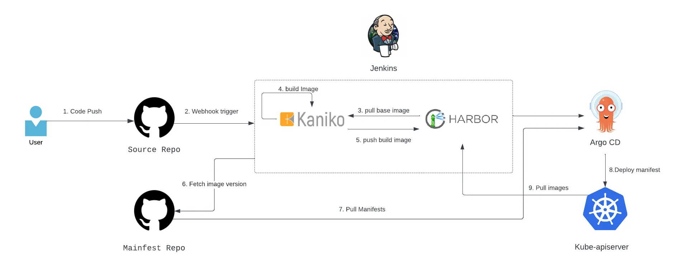

# CI/CD와 PLG 실습 과정

## Azure Login

**Azure VM (Ubuntu 22.04)**
```
sudo apt update 
sudo apt-get upgrade -y
sudo apt-get install -y docker.io 
sudo git clone https://github.com/kangbock/msa_nginx.git 
curl -sL https://aka.ms/InstallAzureCLIDeb | sudo bash
az login --service-principal --username $APPID --password $APPPW --tenant $TENANT --output table
az account set --subscription kblee_cc1_gp_mpn_2-cloudsecurity-02
az aks install-cli
az aks get-credentials --resource-group poc-rg --name poc-test-aks
```

**Helm Install**
```
curl -fsSL -o get_helm.sh https://raw.githubusercontent.com/helm/helm/main/scripts/get-helm-3
chmod 700 get_helm.sh
./get_helm.sh
```

## Cert-manager
```
kubectl create namespace cert-manager

# Add the Jetstack Helm repository
helm repo add jetstack https://charts.jetstack.io

# Update your local Helm chart repository cache
helm repo update

# Install the cert-manager Helm chart
helm install cert-manager jetstack/cert-manager \
  --namespace cert-manager \
  --version=v1.8.0 \
  --set installCRDs=true \
  --set nodeSelector."kubernetes\.io/os"=linux
```

## Harbor
```
kubectl create ns devops-tools
kubectl apply -f RnR/harbor/harbor-certificate.yaml
kubectl get nodes --show-labels | grep linux
```

**Harbor Deploy**
```
# nginx ingress controller install
helm repo add ingress-nginx https://kubernetes.github.io/ingress-nginx
helm repo update

helm install ingress-nginx ingress-nginx/ingress-nginx \
  --set controller.service.annotations."service\.beta\.kubernetes\.io/azure-load-balancer-health-probe-request-path"=/healthz

# repo 등록
helm repo add harbor https://helm.goharbor.io

# 압축파일 다운로드
helm fetch harbor/harbor --untar

# env
sed -i 's/core.harbor.domain/harbor.k-tech.cloud/g' ./harbor/values.yaml
sed -i 's/className: ""/className: "nginx"/g' ./harbor/values.yaml
sed -i '19 s/certSource: auto/certSource: secret/g' ./harbor/values.yaml
sed -i '28 s/secretName: ""/secretName: harbor-secret/g' ./harbor/values.yaml
sed -i '/# for Envoy/a\      certmanager.k8s.io/disable-auto-restart: "true"' ./harbor/values.yaml
sed -i '/# for Envoy/a\      cert-manager.io/cluster-issuer: letsencrypt' ./harbor/values.yaml
# sed -i '/# for Envoy/a\      cert-manager.io/cluster-issuer: letsencrypt-staging' ./harbor/values.yaml

# harbor deploy
helm install harbor -f ./harbor/values.yaml ./harbor/. -n devops-tools

# Harbor login
# ID : admin
# PW : Harbor12345
```

**Cluster Issuer**
```
kubectl apply -f cert-manager/.
```

## Istio

**Isito Download**
```
curl -L https://istio.io/downloadIstio | sh -
mv istio-1.24.1 istio
cd istio
export PATH=$PWD/bin:$PATH
cd ..
```

**Istio Deploy**
```
istioctl install --set profile=default -y
# istioctl install --set profile=demo --skip-confirmation
```

**auto sidecar injection**
```
kubectl label namespace default istio-injection=enabled --overwrite
kubectl label namespace istio-system istio-injection=enabled --overwrite
kubectl label namespace monitoring istio-injection=enabled --overwrite

kubectl get namespace -L istio-injection
```

**sidecar check**
```
istioctl experimental check-inject <pod-name>
```

## Jenkins
**Workflow**


**Deploy**
```
kubectl apply -f RnR/jenkins/.
```

**Password**
```
kubectl exec -it svc/jenkins-service -n devops-tools -- cat /var/jenkins_home/secrets/initialAdminPassword
```

### Slack Notification

**https://워크스페이스.slack.com/apps** 에 접속하여 **Jenkins Ci 앱** 설치
Jenkins Ci 설정 지침 단계에 따라 구성


<aside>
💡 **플러그인 관리 → kubernetes, slack notification 설치**

</aside>

<aside>
💡 **시스템 설정 → GitHub Server, slack 연결**

</aside>

<aside>
💡 **Node 관리 → Clouds → New Cloud → WebSocket Check**

</aside>

## Kaniko
**Docker** : Docker는 Docker 데몬이 호스트 시스템에서 실행되고 이미지를 빌드하는 데몬 기반 접근 방식을 사용합니다. 이를 위해서는 특히 Kubernetes 클러스터에서 보안 문제가 될 수 있는 권한 있는 액세스가 필요합니다.

**Kaniko** : Kaniko는 컨테이너 또는 Kubernetes 클러스터 내부의 Dockerfile에서 컨테이너 이미지를 빌드하는 도구입니다. 특별한 권한이 필요하지 않으므로 Kubernetes 환경의 보안이 더욱 강화됩니다.

