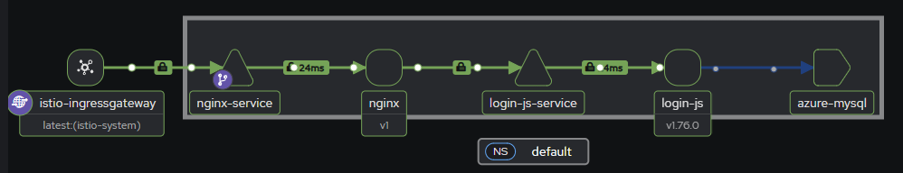
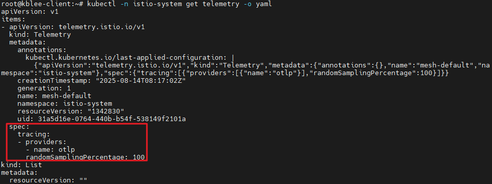
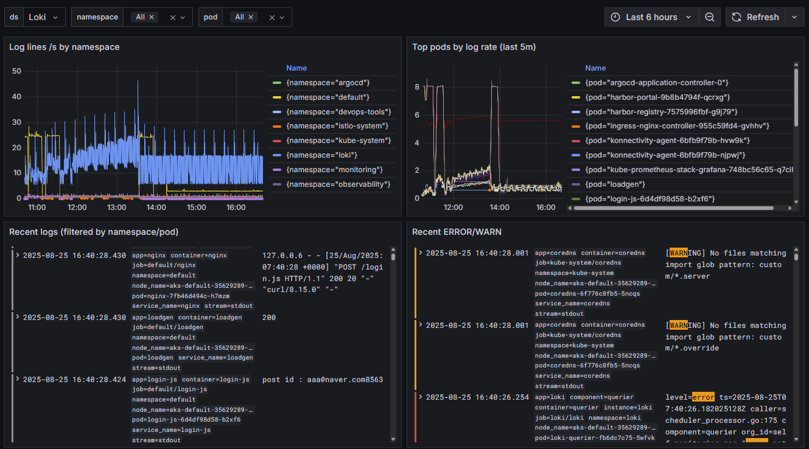

# CI/CD와 PLG 실습 과정

**기술 스택**
| 영역 | 기술/도구 | 용도 및 특징 |
| --- | --- | --- |
| 인프라/환경 | Azure VM (Ubuntu 22.04), Azure CLI, AKS, Docker | Azure 구독에 서비스 프린시펄로 로그인, AKS 컨텍스트 연결, 로컬(또는 점프박스) Ubuntu 22.04에서 Docker/CLI 사용 |
| 패키지/배포 | Helm | 쿠버네티스 앱 배포/관리(Helm 설치 스크립트 사용) |
| 서비스 메시 | Istio | demo 프로필 설치, 네임스페이스 자동 사이드카 주입 |
| 가시화(서비스 메시) | Kiali | 메시 토폴로지/트래픽 가시화 도구 |
| 인그레스 | ingress-nginx | Azure LB 헬스프루브 경로 어노테이션 포함하여 설치 |
| 인증서 관리 | cert-manager (Let’s Encrypt) | ClusterIssuer/Secret 기반 인증서 자동화 |
| 레지스트리 | Harbor | 프라이빗 레지스트리, NGINX Ingress + TLS(Secret/Issuer) 구성 |
| CI | Jenkins | 쿠버네티스에 Jenkins 배포, 플러그인(kubernetes, slack) 사용 |
| 이미지 빌드 | Kaniko | Docker 데몬 없이 K8s 내부에서 이미지 빌드, dockerconfig Secret 사용 |
| CD/GitOps | Argo CD | Git 변경(YAML) 기반 자동 배포 플로우로 사용 |
| 모니터링 | Prometheus | 메트릭 수집 및 Alert 발송(PLG 워크플로우) |
| 알림 | Alertmanager | 경보 라우팅 및 통합 |
| 대시보드 | Grafana | 관측 대시보드(PLG 구성 요소) |
| 로깅 | Grafana Loki | 로그 수집/분석 |
| 알림 연계 | Slack | Jenkins, ArgoCD, Alertmanager 에서 Slack 알림 |
| 참조 리포지토리 | `Terraform Basic` | 사전 작업으로 Terraform 인프라 코드 리포지토리 참조 |
| 애플리케이션 소스 | `msa_nginx`, `msa_deploy` | 이미지 빌드/배포 대상 리포지토리로 Jenkins 파이프라인에서 사용 |
<br>

## 사전 작업 - Terraform 인프라 구성

Terraform을 사용하여 인프라를 코드로 관리하고 자동화합니다.

- GitHub Repository: [Terraform Basic](https://github.com/kangbock/terraform-basic)
<br><br>


## CI/CD 

지속적 통합과 배포 자동화를 위한 파이프라인을 Jenkins, Kaniko, Harbor, ArgoCD로 구성합니다.
<br>

**Workflow**

<br>

- Jenkins로 소스코드 통합 빌드
- Kaniko로 Docker 이미지 생성 후 Harbor에 이미지 푸시
- ArgoCD가 변경된 배포 YAML을 통해 자동 배포 수행
- Slack으로 상태 알림
<br><br>


## PLG

애플리케이션과 인프라의 메트릭 및 로그를 수집하여 관찰성을 높이고 분석합니다.
<br>

### Prometheus Workflow

메트릭 수집 및 알림 발송
<br>


<br>

### Grafana Loki Workflow

로그 수집 및 분석
<br>


<br><br>


## Azure Login

Azure VM(Ubuntu)에서 Docker, Azure CLI 및 Kubernetes CLI 설정 및 AKS 연결
<br>

**Azure VM (Ubuntu 22.04)**
```
sudo apt update 
sudo apt-get upgrade -y
sudo apt-get install -y docker.io 
sudo git clone https://github.com/kangbock/msa_nginx.git 
curl -sL https://aka.ms/InstallAzureCLIDeb | sudo bash
az login --service-principal --username $APPID --password $APPPW --tenant $TENANT --output table
az account set --subscription kblee_cc1_gp_mpn_2-cloudsecurity-02
az aks install-cli
az aks get-credentials --resource-group poc-rg --name poc-test-aks
```
<br>

**Helm Install**

Helm을 이용하여 Kubernetes 앱 배포 및 관리
<br>

```
curl -fsSL -o get_helm.sh https://raw.githubusercontent.com/helm/helm/main/scripts/get-helm-3
chmod 700 get_helm.sh
./get_helm.sh
```
<br><br>


## Cert-manager

인증서 자동 발급 및 관리 (LetsEncrypt 연동)
<br>

```
kubectl create namespace cert-manager

# Add the Jetstack Helm repository
helm repo add jetstack https://charts.jetstack.io

# Update your local Helm chart repository cache
helm repo update

# Install the cert-manager Helm chart
helm install cert-manager jetstack/cert-manager \
  --namespace cert-manager \
  --version=v1.8.0 \
  --set installCRDs=true \
  --set nodeSelector."kubernetes\.io/os"=linux
```
<br><br>


## Harbor

프라이빗 컨테이너 레지스트리 구축

- NGINX Ingress Controller 및 SSL 적용
- Cert-manager로 자동 인증서 관리
<br>

```
kubectl create ns devops-tools
kubectl apply -f R-D/harbor/harbor-certificate.yaml
kubectl get nodes --show-labels | grep linux
```
<br>

**Cluster Issuer**
```
kubectl apply -f cert-manager/.
```
<br>

**Harbor Deploy**
```
# nginx ingress controller install
helm repo add ingress-nginx https://kubernetes.github.io/ingress-nginx
helm repo update

helm install ingress-nginx ingress-nginx/ingress-nginx \
  --set controller.service.annotations."service\.beta\.kubernetes\.io/azure-load-balancer-health-probe-request-path"=/healthz

# repo 등록
helm repo add harbor https://helm.goharbor.io

# 압축파일 다운로드
helm fetch harbor/harbor --untar

# env
sed -i 's/core.harbor.domain/harbor.k-tech.cloud/g' ./harbor/values.yaml
sed -i 's/className: ""/className: "nginx"/g' ./harbor/values.yaml
sed -i '19 s/certSource: auto/certSource: secret/g' ./harbor/values.yaml
sed -i '28 s/secretName: ""/secretName: harbor-secret/g' ./harbor/values.yaml
sed -i '/# for Envoy/a\      certmanager.k8s.io/disable-auto-restart: "true"' ./harbor/values.yaml
sed -i '/# for Envoy/a\      cert-manager.io/cluster-issuer: letsencrypt' ./harbor/values.yaml
# sed -i '/# for Envoy/a\      cert-manager.io/cluster-issuer: letsencrypt-staging' ./harbor/values.yaml

# harbor deploy
helm install harbor -f ./harbor/values.yaml ./harbor/. -n devops-tools

# Harbor login
# ID : admin
# PW : Harbor12345
```
<br>


<br><br>


## Istio Service Mesh

서비스 간 통신 보안과 관리

- 자동 사이드카 주입
- Kiali를 통한 가시성 확보
<br>

**Isito Download**
```
curl -L https://istio.io/downloadIstio | sh -
mv istio-1.24.2 istio
cd istio
export PATH=$PWD/bin:$PATH
cd ..
```
<br>

**Istio Deploy**
```
istioctl install --set profile=demo -y
# istioctl install --set profile=demo --skip-confirmation
```
<br>

**auto sidecar injection**
```
kubectl label namespace default istio-injection=enabled --overwrite

kubectl get namespace -L istio-injection
```
<br>

**sidecar check**
```
istioctl experimental check-inject <pod-name>
```
<br><br>

## Jenkins

**Deploy**
```
kubectl apply -f R-D/jenkins/.
```
<br>

**Password**
```
kubectl exec -it svc/jenkins-service -n devops-tools -- cat /var/jenkins_home/secrets/initialAdminPassword
```
<br>

<aside class="warning">💡 플러그인 관리 → kubernetes, slack notification, prometheus metrics, CloudBees Disk Usage Simple 설치</aside><br>

<aside class="warning">💡 시스템 설정 → GitHub Server, slack 연결</aside><br>

<aside class="warning">💡 Node 관리 → Clouds → New Cloud → WebSocket Check</aside><br><br>

### Kaniko

컨테이너 이미지 빌드를 위한 보안 강화 도구

- Docker 데몬 없이 Kubernetes 내부 빌드 가능
<br>

#### Docker vs Kaniko
**Docker** : Docker는 Docker 데몬이 호스트 시스템에서 실행되고 이미지를 빌드하는 데몬 기반 접근 방식을 사용합니다. 이를 위해서는 특히 Kubernetes 클러스터에서 보안 문제가 될 수 있는 권한 있는 액세스가 필요합니다.

**Kaniko** : Kaniko는 컨테이너 또는 Kubernetes 클러스터 내부의 Dockerfile에서 컨테이너 이미지를 빌드하는 도구입니다. 특별한 권한이 필요하지 않으므로 Kubernetes 환경의 보안이 더욱 강화됩니다.
<br>

**Create secret**
```
docker login https://harbor.k-tech.cloud
cat ~/.docker/config.json
cat ~/.docker/config.json | base64
```
<br>

**regcred.yaml**
```
apiVersion: v1
kind: Secret
metadata:
  name: docker-config-secret
  namespace: default
data:
  .dockerconfigjson: 인코딩한 데이터
type: kubernetes.io/dockerconfigjson
```

```
kubectl apply -f R-D/kaniko/regcred.yaml
kubectl apply -n devops-tools -f R-D/kaniko/regcred.yaml
kubectl apply -n istio-system -f R-D/kaniko/regcred.yaml
```
<br>

### Jenkins Pipeline 구성

CI/CD 자동화를 위한 Jenkins Pipeline

- Kaniko를 이용한 컨테이너 이미지 빌드
- GitOps를 통한 자동 배포
- Slack 알림 연동
<br>

**Configuration**
<aside class="warning">💡 check : Do not allow the pipeline to resume if the controller restarts</aside><br>

<aside  class="warning">💡 check : GitHub hook trigger for GITScm polling</aside><br><br>

**Frontend**
```
podTemplate(yaml: '''
    apiVersion: v1
    kind: Pod
    metadata:
      name: nginx
    spec:
      containers:
      - name: alpine
        image: alpine/git:latest
        command:
        - sleep
        args:
        - 99d
      - name: kaniko
        image: gcr.io/kaniko-project/executor:debug
        command:
        - sleep
        args:
        - 99d
        volumeMounts:
        - name: kaniko-secret
          mountPath: /kaniko/.docker
      restartPolicy: Never
      volumes:
      - name: kaniko-secret
        secret:
          secretName: docker-config-secret
          items:
            - key: .dockerconfigjson
              path: config.json
''') {

    node(POD_LABEL) {
        try {
            stage("Set Variable") {
                git url: 'https://github.com/kangbock/msa_nginx.git', branch: 'main'
                script(){
                    env.GIT_COMMIT = sh(script: "git rev-parse HEAD", returnStdout: true).trim()
                    GIT_TAG = sh (script: 'git describe --always', returnStdout: true).trim();
                    SLACK_CHANNEL = "#devops";
                    SLACK_SUCCESS_COLOR = "#2C953C";
                    SLACK_FAIL_COLOR = "#FF3232";
                    // Git Commit 계정
                    GIT_COMMIT_AUTHOR = sh(script: "git --no-pager show -s --format=%an ${env.GIT_COMMIT}", returnStdout: true).trim();
                    // Git Commit 메시지
                    GIT_COMMIT_MESSAGE = sh(script: "git --no-pager show -s --format=%B ${env.GIT_COMMIT}", returnStdout: true).trim();
                }
            }
            slackSend (
                channel: SLACK_CHANNEL,
                color: SLACK_SUCCESS_COLOR,
                message: "========================================\n The ${env.JOB_NAME}(${env.BUILD_NUMBER}) pipeline has started.\n\n          Author : ${GIT_COMMIT_AUTHOR} \n          Commit Message : ${GIT_COMMIT_MESSAGE}\n\n${env.BUILD_URL}"
            )
        } catch(git) {
                slackSend (
                    channel: SLACK_CHANNEL,
                    color: SLACK_SUCCESS_COLOR,
                    message: "========================================\n${env.JOB_NAME}(${env.BUILD_NUMBER}) pipeline failed.\n\n          Author : ${GIT_COMMIT_AUTHOR} \n          Commit Message : ${GIT_COMMIT_MESSAGE}\n\n${env.BUILD_URL}"
                )
            throw git;
        }
        

        stage('Kaniko Build and Push') {
            git url: 'https://github.com/kangbock/msa_nginx.git', branch: 'main'
            
            container('kaniko') {
                try {
                    stage('nginx') {
                        sh '/kaniko/executor -f `pwd`/Dockerfile -c `pwd` --insecure --cache=true --destination=harbor.k-tech.cloud/msa/nginx:${BUILD_NUMBER}'
                    }
                    slackSend (
                        channel: SLACK_CHANNEL,
                        color: SLACK_SUCCESS_COLOR,
                        message: "NGINX Image Deployment and Push Successfully."
                    )
                } catch(Build) {
                    slackSend (
                        channel: SLACK_CHANNEL,
                        color: SLACK_FAIL_COLOR,
                        message: "Image deployment and push failed."
                    )
                    throw Build;
                }
            }
            
            git url: 'https://github.com/kangbock/msa_deploy.git', branch: 'main'
            container('alpine') {
                try {
                    stage('GitHub Push') {
                        sh 'sed -i s/nginx:.*/nginx:${BUILD_NUMBER}/g ./nginx.yaml'
		                    sh 'git config --global --add safe.directory /home/jenkins/agent/workspace/nginx'
		                    sh 'git config --global user.email \'kangbock@naver.com\''
		                    sh 'git config --global user.name \'kangbock\''
		                    sh 'git config --global --add safe.directory /home/jenkins/agent/workspace/main'
		                    sh 'git add ./'
		                    sh 'git commit -a -m "updated the image tag to ${BUILD_NUMBER}" || true'
		                    sh 'git remote add kb97 https://<GIT_TOKEN>@github.com/kangbock/msa_deploy.git'
		                    sh 'git push -u kb97 main'
                    }
                    slackSend (
                        channel: SLACK_CHANNEL,
                        color: SLACK_SUCCESS_COLOR,
                        message: "Deployment was successful.\n========================================"
                    )
                } catch(push) {
                    slackSend (
                        channel: SLACK_CHANNEL,
                        color: SLACK_FAIL_COLOR,
                        message: "Deployment failed.\n========================================"
                    )
                    throw push;
                }
            }
        }
    }
}
```
<br>

**Backend (Login)**
```
podTemplate(yaml: '''
    apiVersion: v1
    kind: Pod
    metadata:
      name: login
    spec:
      containers:
      - name: alpine
        image: alpine/git:latest
        command:
        - sleep
        args:
        - 99d
      - name: kaniko
        image: gcr.io/kaniko-project/executor:debug
        command:
        - sleep
        args:
        - 99d
        volumeMounts:
        - name: kaniko-secret
          mountPath: /kaniko/.docker
      restartPolicy: Never
      volumes:
      - name: kaniko-secret
        secret:
          secretName: docker-config-secret
          items:
            - key: .dockerconfigjson
              path: config.json
''') {

    node(POD_LABEL) {
        try {
            stage("Set Variable") {
                git url: 'https://github.com/kangbock/msa_loginjs.git', branch: 'main'
                script(){
                    env.GIT_COMMIT = sh(script: "git rev-parse HEAD", returnStdout: true).trim()
                    GIT_TAG = sh (script: 'git describe --always', returnStdout: true).trim();
                    SLACK_CHANNEL = "#devops";
                    SLACK_SUCCESS_COLOR = "#2C953C";
                    SLACK_FAIL_COLOR = "#FF3232";
                    // Git Commit 계정
                    GIT_COMMIT_AUTHOR = sh(script: "git --no-pager show -s --format=%an ${env.GIT_COMMIT}", returnStdout: true).trim();
                    // Git Commit 메시지
                    GIT_COMMIT_MESSAGE = sh(script: "git --no-pager show -s --format=%B ${env.GIT_COMMIT}", returnStdout: true).trim();
                }
            }
            slackSend (
                channel: SLACK_CHANNEL,
                color: SLACK_SUCCESS_COLOR,
                message: "========================================\n The ${env.JOB_NAME}(${env.BUILD_NUMBER}) pipeline has started.\n\n          Author : ${GIT_COMMIT_AUTHOR} \n          Commit Message : ${GIT_COMMIT_MESSAGE}\n\n${env.BUILD_URL}"
            )
        } catch(git) {
                slackSend (
                    channel: SLACK_CHANNEL,
                    color: SLACK_SUCCESS_COLOR,
                    message: "========================================\n${env.JOB_NAME}(${env.BUILD_NUMBER}) pipeline failed.\n\n          Author : ${GIT_COMMIT_AUTHOR} \n          Commit Message : ${GIT_COMMIT_MESSAGE}\n\n${env.BUILD_URL}"
                )
            throw git;
        }
        

        stage('Kaniko Build and Push') {
            git url: 'https://github.com/kangbock/msa_loginjs.git', branch: 'main'
            
            container('kaniko') {
                try {
                    stage('login') {
                        sh '/kaniko/executor -f `pwd`/Dockerfile -c `pwd` --insecure --cache=true --destination=harbor.k-tech.cloud/msa/login_js:${BUILD_NUMBER}'
                    }
                    slackSend (
                        channel: SLACK_CHANNEL,
                        color: SLACK_SUCCESS_COLOR,
                        message: "LOGIN Image Deployment and Push Successfully."
                    )
                } catch(Build) {
                    slackSend (
                        channel: SLACK_CHANNEL,
                        color: SLACK_FAIL_COLOR,
                        message: "Image deployment and push failed."
                    )
                    throw Build;
                }
            }
            
            git url: 'https://github.com/kangbock/msa_deploy.git', branch: 'main'
            container('alpine') {
                try {
                    stage('GitHub Push') {
                        sh 'sed -i s/login_js:.*/login_js:${BUILD_NUMBER}/g ./login_js.yaml'
		                    sh 'git config --global --add safe.directory /home/jenkins/agent/workspace/login'
		                    sh 'git config --global user.email \'kangbock@naver.com\''
		                    sh 'git config --global user.name \'kangbock\''
		                    sh 'git config --global --add safe.directory /home/jenkins/agent/workspace/main'
		                    sh 'git add ./'
		                    sh 'git commit -a -m "updated the image tag to ${BUILD_NUMBER}" || true'
		                    sh 'git remote add kb97 https://<GIT_TOKEN>@github.com/kangbock/msa_deploy.git'
		                    sh 'git push -u kb97 main'
                    }
                    slackSend (
                        channel: SLACK_CHANNEL,
                        color: SLACK_SUCCESS_COLOR,
                        message: "Deployment was successful.\n========================================"
                    )
                } catch(push) {
                    slackSend (
                        channel: SLACK_CHANNEL,
                        color: SLACK_FAIL_COLOR,
                        message: "Deployment failed.\n========================================"
                    )
                    throw push;
                }
            }
        }
    }
}
```
<br>


<br><br>

### Slack Notification

Jenkins와 Slack을 연동하여 파이프라인 상태 실시간 알림
<br>

**https://워크스페이스.slack.com/apps** 에 접속하여 **Jenkins Ci 앱** 설치<br>
Jenkins Ci 설정 지침 단계에 따라 구성


<br><br>

## ArgoCD

GitOps 기반 지속적 배포 관리

- 자동 동기화 및 Slack 알림 연동
<br>

### ArgoCD Deploy
```
helm repo add argo https://argoproj.github.io/argo-helm
helm repo update

git clone https://github.com/argoproj/argo-helm.git
helm install argocd argo/argo-cd -n argocd -f argo-helm/charts/argo-cd/values.yaml --debug
kubectl apply -f R-D/argocd/argocd-certificate.yaml
kubectl apply -f R-D/argocd/argocd-ingress.yaml
```
<br>

```
# 암호 찾기
kubectl -n argocd get secret argocd-initial-admin-secret -o jsonpath="{.data.password}" | base64 -d; echo
```
<br>


<br>

### ArgoCD Notification

ArgoCD 상태 변경 시 Slack 알림
<br>

**Create ArgoCD App**

https://api.slack.com/apps


<br>

**OAuth & Permissions Bot Token Scopes Setting**


<br>

**Argocd Notifiaction CM Depoly**
```
helm upgrade argocd argo/argo-cd -n argocd -f R-D/argocd/argocd-notification-values.yaml --debug --wait --timeout 10m
```
<br>

**Slack**


<br><br>

## Prometheus

메트릭 기반 모니터링 및 알림 관리

- 이상 발생 시 Slack 알림
<br>

### Prometheus Stack
```
helm repo add prometheus-community https://prometheus-community.github.io/helm-charts
helm repo update
git clone https://github.com/prometheus-community/helm-charts.git
```
<br>

```
helm install kube-prometheus-stack prometheus-community/kube-prometheus-stack --debug --timeout 10m -n monitoring
kubectl apply -f R-D/prometheus/prometheus-certificate.yaml
kubectl apply -f R-D/prometheus/prometheus-ingress.yaml
```
<br>

**Uninstall Command**
```
helm uninstall prometheus
kubectl delete crd alertmanagerconfigs.monitoring.coreos.com
kubectl delete crd alertmanagers.monitoring.coreos.com
kubectl delete crd podmonitors.monitoring.coreos.com
kubectl delete crd probes.monitoring.coreos.com
kubectl delete crd prometheusagents.monitoring.coreos.com
kubectl delete crd prometheuses.monitoring.coreos.com
kubectl delete crd prometheusrules.monitoring.coreos.com
kubectl delete crd scrapeconfigs.monitoring.coreos.com
kubectl delete crd servicemonitors.monitoring.coreos.com
kubectl delete crd thanosrulers.monitoring.coreos.com
```
<br>

### PodMonitor
**Istio — 컨트롤 플레인/게이트웨이**
```
kubectl apply -f R-D/prometheus/podmonitor/istio-envoy.yaml
```
<br>

**Jenkins (API Token 발급)**
```
kubectl apply -f R-D/prometheus/podmonitor/jenkins.yaml
```
<br>

**ArgoCD**
```
kubectl apply -f R-D/prometheus/podmonitor/argocd.yaml
```
<br>

**Cert-Manager**
```
kubectl apply -f R-D/prometheus/podmonitor/cert-manager.yaml
```
<br>

**PodMonitor Target**

<br><br>

### Alertmanager
**Prometheus Stack Update**
```
helm upgrade --install kube-prometheus-stack prometheus-community/kube-prometheus-stack --debug -n monitoring -f R-D/alertmanger/alertmamager-values.yaml
kubectl apply -f R-D/alertmanager/alertmanager-certificate.yaml
kubectl apply -f R-D/alertmanager/alertmanager-ingress.yaml
```
<br>

**Slack Notification**<br>

<br><br>

## Grafana
메트릭 및 로그 시각화와 분석

- Prometheus 및 Loki 데이터 시각화
<br>

```
kubectl apply -f R-D/grafana/grafana-certificate.yaml
kubectl apply -f R-D/grafana/grafana-ingress.yaml
```
<br>

**Grafana admin password**
```
kubectl get secret --namespace monitoring kube-prometheus-stack-grafana -o jsonpath="{.data.admin-password}" | base64 --decode ; echo
```
<br>


<br><br>

### Kiali
**kiali.yaml**
```
data:
  config.yaml: |
    external_services:
      prometheus:
        url: http://kube-prometheus-stack-prometheus.monitoring.svc.cluster.local:9090
      grafana:
        external_url: http://kube-prometheus-stack-grafana.monitoring.svc.cluster.local:80
        internal_url: http://kube-prometheus-stack-grafana.monitoring.svc.cluster.local:80
```
<br>

```
kubectl apply -f istio/samples/addons/kiali.yaml
kubectl apply -f R-D/kiali/kiali-certificate.yaml
kubectl apply -f R-D/kiali/kiali-ingress.yaml
```
<br>


<br><br>

### Tempo
분산 트레이싱 백엔드(시스템)으로 레이턴시 모니터링에 사용함.
OTLP(OpenTelemetry Protocol)를 사용함 <br>

AKS+Istio에서는 **Envoy가 생성한 스팬을 OTLP로 Collector → (Tempo/Jaeger)** 로 전송하고, Grafana/Kiali에서 조회하는 형태가 표준적입니다. 이때 메트릭(Alerting)은 Prometheus/PromQL로, 트레이스 탐색은 TraceQL/Jaeger UI로 역할을 분리합니다. <br>

**스팬(Span)** 은 하나의 트레이스(trace)를 구성하는 **단일 작업 단위**로, *작업 이름(operation name), 시작·종료 시각, 지속시간, 속성(attributes), 이벤트(events), 링크(links), 상태(status), 스팬 컨텍스트(SpanContext)* 를 포함합니다. 스팬들은 **부모–자식 관계**로 연결되어 트레이스(요청의 전체 경로)를 형성합니다. <br>

애플리케이션/프록시(Envoy)가 스팬 생성 → **OTLP/Zipkin** 등으로 **OTel Collector** 수집·전처리 → **트레이싱 백엔드(Tempo/Jaeger)** 저장·색인 → Grafana/Jaeger UI에서 스팬·트레이스 조회(필요 시 **Prometheus 메트릭과 상호 점프**) <br><br>

**prometheus 원격 쓰기(수신) enable**
```
# helm-charts/charts/kube-prometheus-stack/values.yaml
prometheus:
  prometheusSpec:
    enableRemoteWriteReceiver: true
```
<br>

**azure storage account secret**
```
kubectl -n observability create secret generic tempo-azure-credentials \
--from-literal=STORAGE_ACCOUNT_ACCESS_KEY='<Azure_Storage_Account_Key>'
```
<br>

**tempo 배포**
```
helm upgrade -i tempo grafana/tempo-distributed -n observability --create-namespace -f R-D/grafana/tempo/tempo-values.yaml
```
<br>

**흐름과 역할**
- 메시 트래픽 → (스팬) → Tempo → (메트릭) → Prometheus → Grafana
- MeshConfig/Telemetry(정책·샘플링) → Envoy(스팬 생성/OTLP 전송) → Tempo(저장/메트릭 생성) → Prometheus(저장) → Grafana(시각화).
<br>

**Istio → Tempo(OTLP) 전송 설정**
<br>
Mesh 단에서 OTLP Provider를 Tempo Distributor로 지정하고, Telemetry로 샘플링을 켭니다.
<br>

```
# istio-otlp-provider.yaml
apiVersion: install.istio.io/v1alpha1
kind: IstioOperator
metadata:
  name: istio
  namespace: istio-system
spec:
  meshConfig:
    defaultProviders:
      metrics: [prometheus]   # Prometheus 메트릭 활성화 중요!
      tracing: [otlp]
    extensionProviders:
      - name: otlp
        opentelemetry:
          service: tempo-distributor.observability.svc.cluster.local
          port: 4317
```
```
istioctl install -f istio-otlp-provider.yaml -y
kubectl -n istio-system get cm istio -o jsonpath='{.data.mesh}' | sed -n '1,200p'
```

extensionProviders/opentelemetry, defaultProviders.tracing에 otlp가 포함되어야 함
<br><br>

```
kubectl apply -f R-D/grafana/telemetry/istio-telemetry-traces.yaml
kubectl -n istio-system get telemetry -o yaml
```

tracing.providers.name=otlp, randomSamplingPercentage 확인
<br><br>

#### Telemetry를 Tempo와 함께 배포한 이유
**1. Telemetry의 역할**

- **Istio의 관측 데이터 제어 레이어**
    
    Telemetry 리소스는 **트레이싱, 메트릭, 액세스 로그**가 어떻게 수집되고 어떤 백엔드로 전송될지 정책으로 정의합니다.
    
    예: 샘플링 비율(1%→5%), 사용자 정의 태그(env=prod), 특정 메트릭 라벨 추가/제거.
    
- **표준화된 제어**
    
    워크로드/네임스페이스 단위로 세밀한 설정이 가능해 불필요한 신호를 줄이고 필요한 신호만 유지할 수 있습니다.

**2. Tempo의 역할**

- **분산 트레이싱 백엔드**
    
    Tempo는 OpenTelemetry, Zipkin, Jaeger 포맷으로 들어오는 트레이스를 수집·저장하고 Grafana에서 TraceQL을 통해 조회합니다.
    
- **대규모/저비용 설계**
    
    트레이스를 오브젝트 스토리지에 장기 저장하며, 운영자가 필요할 때 상세 트레이스를 검색·분석할 수 있게 해줍니다.

**3. Telemetry + Tempo를 함께 배포하는 이유**

  - **생산–소비 연결**
    - Telemetry는 Istio 프록시가 만들어내는 트레이스(스팬)를 어떻게 가공·전송할지 정의합니다.
    - Tempo는 이 트레이스를 받아 저장·조회하는 역할을 담당합니다.
        
        → Telemetry 없이는 Tempo로의 정확한 트레이스 송신 제어가 어렵습니다.
        
  - **샘플링·태그 일관성 확보**
    - 운영 환경에서는 서비스별로 샘플링 비율이나 태그 체계(서비스명, 클러스터명, 환경 등)를 맞추어야 TraceQL 쿼리가 제대로 동작합니다.
    - Telemetry가 이를 통일해 Tempo에 전달합니다.
  - **백엔드 연계 유연성**
    - Telemetry는 Tempo뿐 아니라 Jaeger, Zipkin 같은 다른 트레이싱 백엔드도 동시에 지원합니다.
    - 따라서 Tempo로 전환·병행 운영할 때 유연성을 확보할 수 있습니다.
  - **운영 비용 최적화**
    - 불필요한 트레이스/메트릭을 줄이고, 중요한 요청만 Tempo에 저장해 스토리지 비용과 분석 복잡도를 줄입니다.

**4. 간단 아키텍처 흐름**

```
[서비스 Pod/Envoy Proxy]
    ↓  (트레이스 생성)
[Istio Telemetry 정책 적용]
    ↓  (샘플링/태그/전송제어, OTLP/Zipkin 포맷)
[Collector or Direct Export]
    ↓
[Tempo Distributor → Ingester → Object Storage]
    ↓
[Grafana (TraceQL)로 조회 및 분석]

```

✅ **정리**: Telemetry는 “**Istio가 생성하는 관측 신호를 어떻게 Tempo 같은 백엔드로 보낼지 제어하는 정책**”이고, Tempo는 “**그 신호를 받아 저장·조회하는 백엔드 시스템**”입니다. 따라서 둘은 **보완 관계**에 있으며, **함께 배포해야 운영자 입장에서 완전한 관측 체계**를 구축할 수 있습니다.
<br>

**실제 프록시 설정 확인**
```
istioctl pc bootstrap deploy/<아무 워크로드> -n <ns> | egrep -i 'opentelemetry|otlp|tempo|zipkin’
```
<br>

**Grafana/Prometheus에서 지표 확인**
- Service Graph:
    
    ```
    sum by (client, server) (rate(traces_service_graph_request_total[5m]))
    ```
    
- Span-metrics(지연 p95):
    
    ```
    histogram_quantile(
      0.95,
      sum by (le, service, span_name) (
        rate(traces_spanmetrics_latency_bucket{span_kind="SPAN_KIND_SERVER"}[5m])
      )
    )
    ```

**Tempo Data Source**
```
kubectl apply -f R-D/grafana/tempo/tempo-datasource.yaml
```

**Tempo Dashboard**
```
kubectl apply -f R-D/grafana/tempo/tempo-dashboard.yaml
```

```
kubectl -n monitoring rollout restart deploy kube-prometheus-stack-grafana
```
<br>

**Grafana Service Map**

<br>

**r/sec**: *requests per second*의 약자입니다. 선택한 시간 창(예: 5분)에서 **요청 처리율**을 초/단위로 나타냅니다.<br>
**ms/r**: *milliseconds per request*의 약자입니다. **요청 1건당 지연시간(밀리초)** 을 의미합니다.<br>

**p95 latency (ms) 패널**<br>
p95(95번째 백분위) 는 전체 요청 중 가장 느린 상위 5% 직전의 지연 시간입니다.<br>
예: p95가 120 ms라면, 95%의 요청은 120 ms 이내에 끝났고, 나머지 5%는 더 느렸다는 뜻입니다.<br>

스팬 단위의 원본 트레이스 저장을 Azure Storage Account로 사용

**tempo 업데이트**
```
helm upgrade -i tempo grafana/tempo-distributed -n observability --create-namespace -f R-D/grafana/tempo/tempo-values2.yaml
```
<br>

**Azure Storage Account tempo-traces Container**

<br>


## Loki

중앙 집중식 로그 수집 및 저장, Grafana로 분석
<br>

### Loki 흐름

<br>

- Collector : 모니터링 대상 시스템이 생성하는 데이터를 Prometheus와 Promtail이 원하는 형식으로 제공
- Prometheus : 시계열 수치(float) 데이터를 저장하는 DB
- Loki : 시계열 로그(string) 데이터를 저장하는 DB
- Promtail : Collector가 출력하는 로그 데이터를 Loki에게 전달
- Grafana : Prometheus와 Loki의 데이터를 시각화
<br>

```
helm repo add grafana https://grafana.github.io/helm-charts
helm repo update

git clone https://github.com/grafana/helm-charts.git grafana
helm install loki grafana/loki --values values.yaml -n monitoring
```
<br>

### Workload Identity 인증
**Workload Identity 및 OIDC 활성화**

<br>

**K8S용 인증서 생성**

<br>

**IAM 권한 추가**

<br>

**loki 배포**
```
helm upgrade loki grafana/loki -f R-D/grafana/loki/loki-values.yaml -n loki --debug --wait --timeout 10m
```
<br>

**필수(Logs 수집·조회가 동작하려면 필요)**

- **Distributor**: 수집(write) 엔드포인트. 클라이언트가 `push`하는 요청을 받아 해시링에 따라 인제스터로 전달.
- **Ingester**: 로그를 수신·조각화(Chunk)하고 오브젝트 스토리지(TSDB)에 업로드.
- **Querier**: LogQL 쿼리 실행.
- **Index Gateway**: TSDB 환경에서 인덱스 질의를 담당(단일/링 모드). 성능·확장성 상 이 경로 권장.
- **Compactor**: TSDB에서 **보존/압축**을 수행하는 **핵심 컴포넌트**. 미가동 시 보존이 적용되지 않습니다.

> 위 5가지는 “분산(마이크로서비스) 모드” Loki의 기본 골격입니다. 컴포넌트들의 역할과 모드는 공식 문서의 구성요소/배포 모드에 정리되어 있습니다.
> 

**선택(없어도 Loki는 동작)**

- **Query Frontend**: 쿼리 분할·캐시·큐잉 등으로 조회 성능을 높이는 프록시. “권장”이지만 **필수는 아님**.
- **Query Scheduler**: **선택적** 컴포넌트. 대규모에서 프런트엔드의 큐를 외부화해 공정성/확장성을 개선.
- **Ruler**: 로그 기반 룰/알림을 사용할 때만 필요.
- **Canary**: 수집 경로를 지속 점검하는 유틸리티. 품질 감시에 유용하나 **운영 필수는 아님**.
- **Chunks/Results Cache(Memcached)**: 성능 최적화용. 비활성화 가능하나, 쿼리·스토리지 부하가 커질 수 있습니다.
- **Gateway(NGINX)**: 외부 진입 단일 창구가 필요 없거나, Istio/Ingress로 직접 라우팅할 계획이면 생략 가능.
<br>

**Loki Data Source**
```
kubectl apply -f R-D/grafana/loki/loki-datasource.yaml
```
<br>

**Promtail 배포**
```
kubectl apply -f R-D/grafana/promtail/promtail-values.yaml
```
```
helm upgrade --install promtail grafana/promtail -n monitoring --debug -f promtail-values.yaml
```
<br>

**Loki Dashboard**
```
kubectl apply -f R-D/grafana/loki/loki-dashboard.yaml
```

<br>

**Azure Storage Account**

<br>